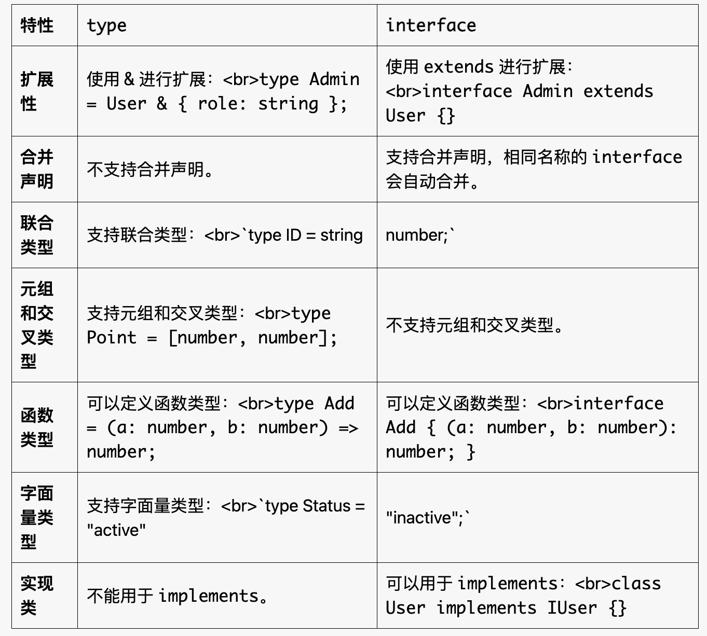

### type 和 interface 的区别

1. 基本语法

```typescript
type User = {
  name: string;
  age: number;
};

interface User {
  name: string;
  age: number;
}


```

2. 主要区别



**总结**

type 和 interface 在 TypeScript 中各有优势，选择哪个取决于具体的使用场景。如果你需要定义对象类型或扩展性，优先使用 interface；如果需要处理复杂的类型组合，使用 type。希望这些对比能帮助你更好地理解它们的区别！如果有更多问题，随时告诉我


### JS 中的基本类型和引用类型的区别

据类型分为 基本类型（Primitive Types） 和 引用类型（Reference Types）。它们的区别主要体现在存储方式、赋值行为、比较方式和内存管理等方面。以下是详细的对比：

1. 基本类型（Primitive Types）

包含类型: number string boolean null undefined symbol（ES6 新增）bigint（ES2020 新增

存储方式：值直接存储在栈内存中。

赋值行为：赋值时会复制值，两个变量互不影响

内存管理：基本类型的值是不可变的（immutable），修改时会创建一个新值。


引用类型（Reference Types）

包含类型: object array function date regexp 

存储方式：值存储在堆内存中，栈内存中存储的是堆内存地址（引用）。

赋值行为：赋值时复制的是引用（地址），两个变量指向同一个对象。
javascript

内存管理：引用类型的值是可变的（mutable），修改对象时不会创建新对象。

比较方式：比较的是引用（地址），而不是值。


### JS 中的事件循环

JavaScript 是单线程的，但它通过事件循环实现了异步行为。事件循环的核心包括以下几个部分：

调用栈（Call Stack）：用于存储函数的执行上下文，遵循先进后出（LIFO）的原则。

任务队列（Task Queue）：用于存储待执行的回调函数（如 setTimeout、Promise 等）。

微任务队列（Microtask Queue）：用于存储高优先级的回调函数（如 Promise 的 then、MutationObserver 等）。

事件循环：不断检查调用栈和任务队列，将任务队列中的回调函数推入调用栈执行。

**事件循环的执行顺序**

同步代码：最先执行。

微任务：在同步代码执行完后，立即执行所有微任务。

宏任务：每次从任务队列中取出一个宏任务执行。

重复：重复上述过程。

**宏任务（Macrotasks）**

setTimeout
setInterval
setImmediate（Node.js）
I/O 操作（如文件读写、网络请求）
UI 渲染（浏览器）

**微任务（Microtasks）**

Promise 的 then 和 catch
process.nextTick（Node.js）
MutationObserver（浏览器）


**浏览器和 Node.js 的事件循环差异**

浏览器：
事件循环包括宏任务和微任务。

宏任务包括 setTimeout、setInterval、I/O、UI 渲染 等。

微任务包括 Promise、MutationObserver 等。

Node.js：

事件循环分为多个阶段（如 timers、poll、check 等）。

宏任务包括 setTimeout、setImmediate、I/O 等。

微任务包括 Promise、process.nextTick 等。


**为什么微任务优先于宏任务？**

微任务通常用于处理高优先级的任务（如 Promise 的回调），确保它们能够尽快执行。

**process.nextTick 和 Promise 的区别？**

在 Node.js 中，process.nextTick 的优先级高于 Promise，会在当前阶段立即执行。

**如何避免事件循环阻塞？**

避免长时间运行的同步代码。
将耗时操作放入异步任务中（如 setTimeout、Promise）。


### 原型链的终点

在 JavaScript 中，原型链（Prototype Chain） 是对象之间继承关系的基础。

**1. 原型链的构成**

每个对象都有一个内部属性 [[Prototype]]，指向其原型对象。
原型对象也有自己的 [[Prototype]]，形成一条链。
原型链的终点是 null，表示没有更多的原型。

**2. 原型链的查找机制**

当访问一个对象的属性或方法时，JavaScript 引擎会按照以下步骤查找：
在对象自身查找。

如果找不到，沿着原型链向上查找。
如果找到原型链的终点（null），返回 undefined。


**3. 原型链的终点**

Object.prototype 是大多数对象的最终原型。
Object.prototype.__proto__ 是 null，表示原型链的终点。

**4. 示例**

```javascript
let obj = { name: "Alice" };

console.log(obj.__proto__ === Object.prototype); // true
console.log(Object.prototype.__proto__); // null


// Object.create(null)：创建一个没有原型的对象
let obj = Object.create(null);
console.log(obj.__proto__); // undefined
```

### promise 常用的 API

Promise.all() 等待所有 Promise 完成，返回一个包含所有结果的数组。如果有一个失败，立即返回失败。

Promise.allSettled() 等待所有 Promise 完成，返回一个包含所有结果的对象数组，无论成功还是失败。

Promise.race() 返回第一个完成的 Promise，无论成功还是失败。

Promise.any() 返回第一个成功的 Promise。如果所有 Promise 都失败，返回一个 AggregateError。

### ESM （es6 module）和 commonjs 的区别

ESM 和 CommonJS 是 JavaScript 中两种不同的模块化规范。它们在语法、加载方式和适用场景上有显著的区别。以下是它们的详细对比：

```js

//语法 CommonJS require 导入模块，module.exports 导出模块。
// 导入
const fs = require('fs');

// 导出
module.exports = {
  myFunction: () => console.log("Hello, CommonJS!")
};

// ES6 (ESM) 使用 import 导入模块，export 导出模块。

// 导入
import fs from 'fs';

// 导出
export const myFunction = () => console.log("Hello, ES6!");
```


**加载方式**

CommonJS

同步加载：模块在运行时加载，适用于服务器端（如 Node.js）。

动态导入：支持运行时动态加载模块。

```javascript
const moduleName = 'fs';
const fs = require(moduleName);
```

ESM

异步加载：模块在编译时加载，适用于浏览器和现代 JavaScript 环境。

静态导入：导入语句必须在模块的顶层，不能动态加载。

```javascript
// 静态导入
import fs from 'fs';

// 动态导入（需要支持的环境）
const moduleName = 'fs';
import(moduleName).then((fs) => {
  // 使用 fs
});
```

**适用场景**

CommonJS 是 Node.js 的默认模块化规范。

浏览器：ESM 模块化是浏览器的标准

现代 JavaScript：适用于支持 ESM 的环境（如现代浏览器、Node.js 12+）。

ESM: 支持树摇（Tree Shaking），可以优化打包体积。


### 浏览器的有几种缓存方式

**强缓存**

强缓存是指浏览器直接从本地缓存中加载资源，不会向服务器发送请求。

实现方式

Expires：HTTP/1.0 的字段，指定资源的过期时间（绝对时间）。


Cache-Control：HTTP/1.1 的字段，优先级高于 Expires，常用指令包括：

max-age：资源的最大缓存时间（秒）。

no-cache：强制向服务器验证缓存。

no-store：禁止缓存。

public：资源可以被所有用户缓存。

private：资源只能被单个用户缓存。

```
Cache-Control: max-age=3600
```

**特点**: 缓存有效期内，浏览器直接从本地加载资源，不会发送请求。
缓存过期后，浏览器会向服务器发送请求验证缓存。

**协商缓存**

协商缓存是指浏览器向服务器发送请求验证缓存是否有效，如果有效则返回 304 状态码，浏览器使用本地缓存。

Last-Modified / If-Modified-Since：
服务器返回资源时，带上 Last-Modified 字段，表示资源的最后修改时间。
浏览器再次请求时，带上 If-Modified-Since 字段，服务器根据时间判断资源是否变化。

ETag / If-None-Match：
服务器返回资源时，带上 ETag 字段，表示资源的唯一标识。
浏览器再次请求时，带上 If-None-Match 字段，服务器根据标识判断资源是否变化。


**特点**

浏览器每次都会发送请求，服务器根据缓存标识判断资源是否变化。

如果缓存有效，返回 304 状态码，浏览器使用本地缓存。


### 在浏览器的渲染过程中，什么情况下会阻塞渲染
在浏览器的渲染过程中，有几种情况可能会导致渲染被阻塞：

### 1. **JavaScript 执行**
- **同步脚本**：如果在 HTML 中使用了 `script` 标签且没有 `async` 或 `defer` 属性，浏览器会在遇到该脚本时停止渲染，直到脚本执行完成。
- **长时间运行的脚本**：如果 JavaScript 代码执行时间过长，渲染会被阻塞，导致用户体验下降。

### 2. **CSS 加载**
- **阻塞样式表**：在文档中，CSS 文件的加载是阻塞渲染的。如果 CSS 文件未加载完成，浏览器不会渲染页面，直到样式可用。
- **内联样式**：如果内联样式存在，同样会阻塞渲染。

### 3. **图片和媒体资源**
- **大图片文件**：如果图片资源较大且未进行优化，加载时间可能会影响页面的整体渲染。
- **延迟加载的资源**：未正确实现懒加载的图片或视频可能会影响首屏渲染。

### 4. **网络请求**
- **异步请求**：如果页面依赖于异步请求（如 AJAX），并且这些请求结果影响了页面的渲染，可能会导致渲染延迟。
- **HTTP/2 优化**：在使用 HTTP/2 时，资源的加载可能会更高效，但仍然可能出现某些请求阻塞渲染。

### 5. **重排和重绘**
- **DOM 修改**：频繁的 DOM 操作可能导致重排和重绘，从而影响渲染性能。
- **样式变化**：动态更改元素样式也会引发重排，影响渲染流畅度。


### 总结
为了提高页面渲染性能，建议使用异步加载的脚本、优化资源加载、减少重排和重绘，并合理使用 CSS 和 JavaScript。  


### 简单说一下 plugin 和 loader 的区别
在前端构建工具（如 Webpack）中，**plugin** 和 **loader** 的主要区别如下：

### Loader
- **功能**：用于转换文件类型。Loader 可以将不同类型的文件（如 CSS、Sass、TypeScript 等）转换为 JavaScript 模块。
- **使用场景**：例如，将 Sass 文件编译为 CSS，或将 TypeScript 转换为 JavaScript。
- **运行时机**：在构建过程中，Loader 在模块被解析时执行。

### Plugin
- **功能**：用于扩展构建工具的功能，通常用于执行更复杂的任务，例如优化输出、生成文件等。
- **使用场景**：例如，压缩 JavaScript 代码、生成 HTML 文件、提取 CSS 等。
- **运行时机**：在整个构建过程的不同阶段执行，可以在构建的开始或结束时工作。

### 总结
- **Loader** 是对文件进行转换的工具，专注于单个文件的处理。
- **Plugin** 是用于增强构建过程的工具，可以在多种构建阶段执行更复杂的任务。 


### react.memo


`React.memo` 是一个高阶组件，用于优化函数组件的性能。它通过避免不必要的渲染来提升性能，特别是在组件的 props 没有变化时。

### 主要特点

1. **性能优化**：
   - `React.memo` 只会在组件的 props 改变时重新渲染组件。如果 props 没有变化，React 会复用之前的渲染结果。

2. **用法**：
   - 你可以将一个函数组件包裹在 `React.memo` 中，以实现性能优化。

   ```javascript
   import React from 'react';

   const MyComponent = React.memo(({ prop1, prop2 }) => {
       // 组件逻辑
       return <div>{prop1} - {prop2}</div>;
   });
   ```

3. **自定义比较函数**：
   - 默认情况下，`React.memo` 使用浅比较来判断 props 是否变化。你可以提供一个自定义的比较函数，以实现更复杂的比较逻辑。

   ```javascript
   const MyComponent = React.memo(
       ({ prop1, prop2 }) => {
           // 组件逻辑
           return <div>{prop1} - {prop2}</div>;
       },
       (prevProps, nextProps) => {
           // 自定义比较逻辑
           return prevProps.prop1 === nextProps.prop1 && prevProps.prop2 === nextProps.prop2;
       }
   );
   ```

### 使用场景
- 当你有一个性能敏感的组件，并且它的渲染依赖于 props 的变化时，使用 `React.memo` 可以提高性能。
- 特别适合用于渲染列表或复杂组件，减少不必要的重渲染。

### 注意事项
- 如果组件的 props 经常变化，使用 `React.memo` 可能会适得其反，增加额外的开销。
- 在使用 `React.memo` 时，确保你了解组件的渲染逻辑，以便做出合理的性能优化决策。

### 总结
`React.memo` 是一个简单而有效的性能优化工具，适用于需要减少不必要渲染的函数组件。通过合理使用，可以显著提升 React 应用的性能。
